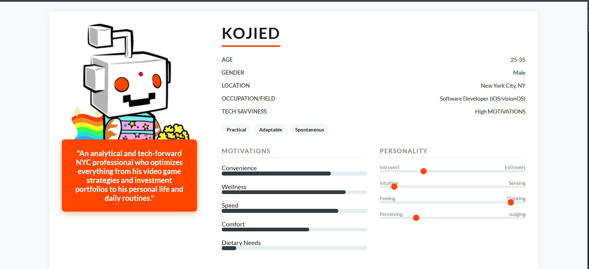
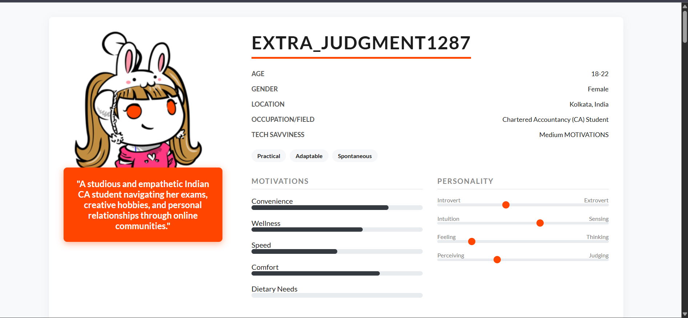

# 🤖 Reddit User Persona Generator using Gemini 2.5 Pro

## 📸 Sample Output



## 🎥 Watch the Demo
[)]


This project is built to **analyze any public Reddit user** and generate a complete **user persona** from their activity using **Google's Gemini 2.5 Pro model**. It generates two types of output:

- `.txt` file — Clean text summary of the user's persona
- `.html` file — Structured and styled version, using Jinja2 templating As you provide example Image.

All links (citations from Reddit posts) are preserved equally in both output files.

---

## 🔧 What It Does

- Uses **PRAW** to fetch user activity from Reddit
- Sends that activity to **Gemini 2.5 Pro** (via `google.generativeai`)
- Outputs a structured **user profile**: personality, goals, frustrations, behavior, MBTI-style traits, etc.
- Saves output in **both .txt and .html** format — from the **same structured data** (no inconsistency)
- Automatically includes the same list of **Reddit post URLs** in both files
- Optional: Shows **profile image** in the HTML report


## 📁 Project Structure


reddit-persona-generator/
├── main.py                   # Main script to run
├── .env                      # Environment variables for API keys
├── persona/
│   ├── reddit\_client.py      # Gets user data from Reddit
│   ├── generator.py          # Sends prompt to Gemini 2.5 Pro
│   ├── html\_exporter.py      # Exports persona data to HTML
│   ├── parser.py             # (Optional) To convert raw text to structured format
│   └── templates/
│       └── persona\_template.html  # HTML design using Jinja2
├── output/                   # Final persona output files (txt + html)
├── requirements.txt
└── README.md


## ✅ Features

- ✅ Uses **Gemini 2.5 Pro** (Google's latest LLM) for high-quality reasoning
- ✅ Outputs both `.txt` and `.html` from the **same structured data**
- ✅ Clean code with modular design (each component has a clear role)
- ✅ HTML report looks like a real user research document
- ✅ Profile picture support (optional)
- ✅ Tested with real Reddit users like `kojied`, `Hungry-Move-6603`, etc.


## ⚙️ Setup Instructions

### 1. Install Dependencies

```bash
pip install -r requirements.txt
````

### 2. Configure Environment Variables

Create a `.env` file in your root directory and add your keys:

```env
REDDIT_CLIENT_ID=your_reddit_app_id
REDDIT_CLIENT_SECRET=your_reddit_secret
REDDIT_USER_AGENT=RedditPersonaApp/0.1           #eg:  PersonaGenerator/0.1 by Impressive-Tour5729
GOOGLE_API_KEY=your_google_generativeai_api_key
```

> 🔐 You can get your Gemini key here: [https://makersuite.google.com/app/apikey](https://makersuite.google.com/app/apikey)
> 🔑 Reddit keys: [https://www.reddit.com/prefs/apps](https://www.reddit.com/prefs/apps)


## 🚀 How to Run

```bash
python main.py <reddit_username_or_url>
```

**Examples:**

```bash
python main.py kojied
python main.py https://www.reddit.com/user/Hungry-Move-6603
```


## 📂 Output

Both files will be saved to the `/output` folder:

```
output/
├── kojied_persona.txt
└── kojied_persona.html
```

✅ Both files include the same list of Reddit post URLs.

✅ The HTML report includes structured sections, styled headings, and  the profile image.

---

## 🌟 Example Output

**🧾 Text Format (.txt)**

```
USER PERSONA: kojied
"The optimal strategy I've discovered is the following..."
...
CITED SOURCES
1. https://reddit.com/...
2. https://reddit.com/...
```

**🌐 HTML Report (.html)**
Includes same persona data, but visually structured using HTML (Jinja2).
Also includes all source links and optional profile avatar.

---

## 🧠 Optional Improvements (for future)

* Add Streamlit or Flask frontend
* Deploy to Hugging Face Spaces or Replit
* Add unit tests for Reddit and generator modules
* Add PDF export option
* Turn this into a REST API or microservice


## 🙌 Credits

Made by **Nihal Jaiswal**
Built during internship assignment for Generative AI domain
Model used: `models/gemini-2.5-pro`

